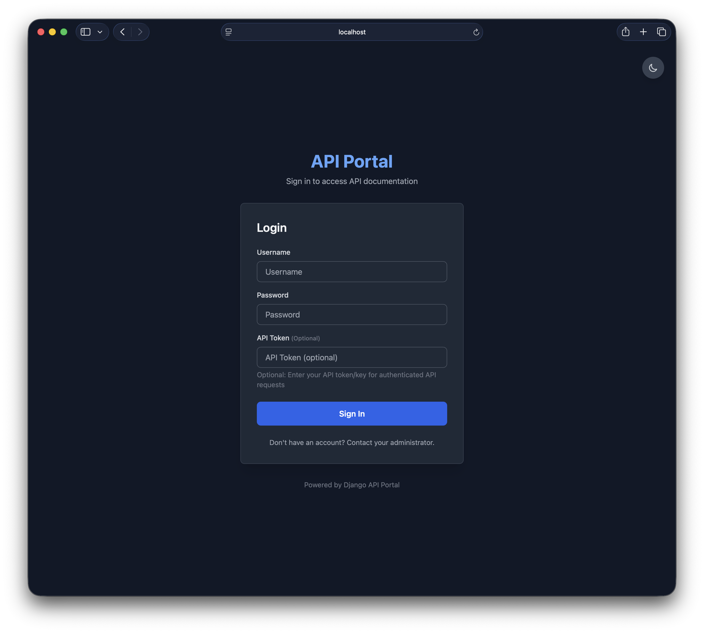
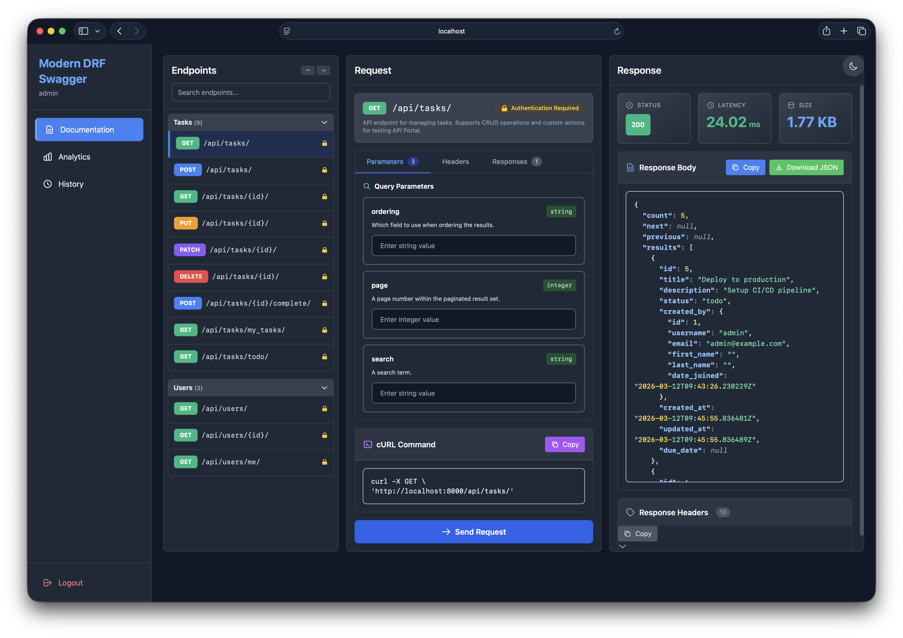
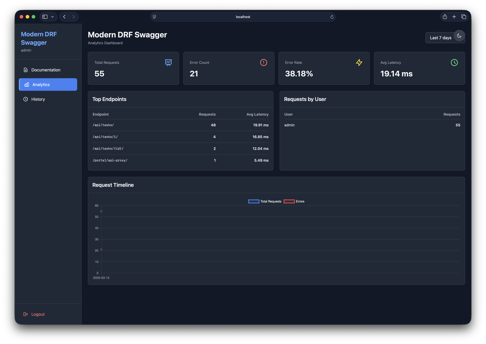

# Modern DRF Swagger 🚀

A modern, team-based API developer portal for Django REST Framework projects with built-in analytics and granular access control.

[](https://pypi.org/project/modern-drf-swagger/)


> **Created by [DavronbekDev](https://davronbek.dev) • [GitHub](https://github.com/firdavsDev) • [Email](mailto:davronbekboltyev777@gmail.com)**

---

## 📸 Screenshots

<div align="center">

### Login Page


*Secure login with dark/light theme support and password visibility toggle*

### API Explorer


*Modern interface for browsing, testing, and exploring your API endpoints*

### Analytics Dashboard


*Track API usage, latency, and error rates with beautiful charts*

</div>

---

## Features

- 🎨 **Modern API Explorer**: Clean, dark-themed interface for exploring and testing DRF APIs
- 👥 **Team Management**: Role-based access control (Super Admin, Admin, Developer, Viewer)
- 🔒 **Endpoint Permissions**: Granular control over which teams can access specific endpoints
- 📊 **Analytics Dashboard**: Track API usage, latency, and error rates with charts
- 📝 **Request History**: Personal history with search, filtering, and request replay (auto-cleanup of old logs)
- 🎯 **Schema-Driven**: Automatically discovers endpoints via drf-spectacular
- ⚡ **Real Request Proxy**: Execute actual HTTP requests with accurate latency measurement
- 🎨 **Syntax Highlighting**: JSON responses with color-coded syntax
- 🔍 **Search & Filter**: Quickly find endpoints and past requests
- 🔖 **Bookmarkable Endpoints**: URL hash routing preserves selected endpoint on refresh
- 📦 **Collapsible Groups**: Organize endpoints by tags with collapse/expand controls

## 📦 Installation

### Requirements

- Python 3.8+
- Django 3.2+
- Django REST Framework 3.12+
- drf-spectacular 0.26+

### Install from PyPI

```bash
pip install modern-drf-swagger
```

### Or Install from Source

```bash
git clone https://github.com/firdavsDev/modern-drf-swagger.git
cd modern-drf-swagger
pip install -e .
```

## 🚀 Quick Start

**Want to get started in 5 minutes?** Check out the [**QUICKSTART.md**](QUICKSTART.md) guide!

### 1. Add to INSTALLED_APPS

```python
# settings.py
INSTALLED_APPS = [
    'django.contrib.admin',
    'django.contrib.auth',
    'django.contrib.contenttypes',
    'django.contrib.sessions',
    'django.contrib.messages',
    'django.contrib.staticfiles',
    
    # Third-party
    'rest_framework',
    'drf_spectacular',
    
    # API Portal
    'api_portal',
    
    # Your apps
    'myapp',
]
```

### 2. Configure DRF and drf-spectacular

```python
# settings.py
REST_FRAMEWORK = {
    'DEFAULT_SCHEMA_CLASS': 'drf_spectacular.openapi.AutoSchema',
    'DEFAULT_AUTHENTICATION_CLASSES': [
        'rest_framework.authentication.SessionAuthentication',
        'rest_framework.authentication.BasicAuthentication',
    ],
    'DEFAULT_PERMISSION_CLASSES': [
        'rest_framework.permissions.IsAuthenticated',
    ],
}

SPECTACULAR_SETTINGS = {
    'TITLE': 'My API',
    'DESCRIPTION': 'API documentation',
    'VERSION': '1.0.0',
    'SERVE_INCLUDE_SCHEMA': False,
}
```

### 3. Configure API Portal

```python
# settings.py
API_PORTAL = {
    'TITLE': 'My Company API Portal',
    'ANALYTICS_ENABLED': True,
    'HISTORY_LIMIT': 100,
    'ALLOW_ANONYMOUS': False,
    'EXCLUDE_PATHS': ['/admin/', '/internal/'],
}
```

### 4. Add URL Routes

```python
# urls.py
from django.contrib import admin
from django.urls import path, include

urlpatterns = [
    path('admin/', admin.site.urls),
    path('api/', include('myapp.urls')),  # Your API
    path('portal/', include('api_portal.urls')),  # API Portal
]
```

### 5. Run Migrations

```bash
python manage.py migrate
```

### 6. Create Superuser and Setup Teams

```bash
python manage.py createsuperuser
python manage.py runserver
```

Visit `http://localhost:8000/admin` to:
1. Create teams
2. Add team members with roles
3. Grant endpoint permissions to teams

### 7. Access the Portal

Visit `http://localhost:8000/portal/` and login with your credentials.

## Usage

### Team Management (Admin Panel)

1. **Create Teams**: Go to Admin → Teams → Add Team
2. **Add Members**: In team detail, add users with roles:
   - **Super Admin**: Access to all endpoints
   - **Admin**: Manage team permissions
   - **Developer**: Test endpoints
   - **Viewer**: Read-only access
3. **Grant Permissions**: Add Endpoint Permissions:
   - Path: `/api/users/`
   - Methods: `GET,POST` or `*` for all

### API Explorer

The main interface (`/portal/`) provides:

- **Endpoint List** (left panel): Browse all available endpoints grouped by tags
- **Request Editor** (center): Configure parameters, body, headers
- **Response Viewer** (right): View responses with syntax highlighting

**Features:**
- Click any endpoint to load request form
- Fill in parameters and body (JSON)
- Click "Send Request" to execute
- View response with status, latency, and size
- Copy response to clipboard

### Analytics Dashboard

Access at `/portal/analytics/`:

- Total requests and error counts
- Error rate percentage
- Average latency
- Top 10 endpoints by usage
- Requests by user
- Daily request timeline chart

**Date Range**: Select 7, 30, or 90 days

### Request History

Access at `/portal/history/`:

- View all your past API requests
- Search by endpoint path
- Click "View" to see full request/response details
- Pagination support (50 per page)

## Configuration Reference

### API_PORTAL Settings

| Setting | Type | Default | Description |
|---------|------|---------|-------------|
| `TITLE` | str | `'API Portal'` | Portal title displayed in UI |
| `ANALYTICS_ENABLED` | bool | `True` | Enable/disable request logging |
| `HISTORY_LIMIT` | int | `100` | Max history items per user (auto-deletes oldest) |
| `ALLOW_ANONYMOUS` | bool | `False` | Allow unauthenticated access |
| `EXCLUDE_PATHS` | list | `['/admin/', '/internal/']` | Paths to hide from portal |
| `ENDPOINTS_COLLAPSIBLE` | bool | `True` | Enable endpoint group collapse/expand |
| `ENDPOINTS_DEFAULT_COLLAPSED` | bool | `False` | Start with endpoint groups collapsed |

### Hide Endpoints from Portal

Use the `@hide_from_portal` decorator:

```python
from api_portal.conf import hide_from_portal
from rest_framework import viewsets

@hide_from_portal
class InternalAPIViewSet(viewsets.ModelViewSet):
    # This endpoint won't appear in the portal
    queryset = InternalModel.objects.all()
    serializer_class = InternalSerializer
```

Or use drf-spectacular's `@extend_schema(exclude=True)`.

### URL Hash Routing (Bookmarkable Endpoints)

Selected endpoints are automatically saved to the URL hash, allowing you to:

- **Refresh without losing selection**: The selected endpoint is preserved after page refresh
- **Share direct links**: Share URLs like `http://yoursite.com/portal/#GET:/api/tasks/` with teammates
- **Use browser navigation**: Back/forward buttons work with endpoint selection
- **Bookmark specific endpoints**: Save frequently-used endpoints as browser bookmarks

Format: `#METHOD:/path/to/endpoint/` (e.g., `#GET:/api/users/`, `#POST:/api/tasks/`)

### Auto-Cleanup Old Request Logs

When `ANALYTICS_ENABLED` is `True`, request logs are automatically cleaned up to prevent database bloat:

- **Per-user limit**: Each user can have up to `HISTORY_LIMIT` requests (default: 100)
- **Automatic deletion**: When a new request exceeds the limit, the oldest logs are deleted
- **Keeps most recent**: Always maintains the most recent `HISTORY_LIMIT - 1` logs
- **Runs on each request**: Cleanup happens automatically when new requests are logged
- **Anonymous users**: Not affected by cleanup (logs remain until manually deleted)

Example: With `HISTORY_LIMIT: 50`, each user will have their oldest requests automatically deleted when reaching 51 logs.

## Development Setup

### Running the Example Project

```bash
# Clone and setup
git clone https://github.com/firdavsDev/modern-drf-swagger.git
cd modern-drf-swagger
python -m venv .venv
source .venv/bin/activate  # or .venv\Scripts\activate on Windows
pip install -e .

# Run example
cd sample_project
python manage.py migrate
python manage.py createsuperuser
python manage.py runserver
```

Visit `http://localhost:8000/portal/`

The example project includes sample Task and User APIs for testing.

## Architecture

### Service Layer Pattern

```
Views → Services → Models
```

**Services:**
- `schema_loader.py`: OpenAPI schema parsing via drf-spectacular
- `request_executor.py`: HTTP proxy using `requests` library
- `analytics_service.py`: Request logging and metrics aggregation
- `endpoint_permissions.py`: Permission checking with caching

**Why External HTTP Proxy?**
Uses real HTTP requests (not Django test client) to measure accurate latency and simulate production behavior.

## Troubleshooting

### Common Issues

**"No endpoints found"**
- Ensure drf-spectacular is configured correctly
- Check `INSTALLED_APPS` includes `'drf_spectacular'`
- Verify `DEFAULT_SCHEMA_CLASS` is set

**"Permission denied" errors**
- Check user is member of a team
- Verify team has endpoint permissions
- Superusers bypass all permissions

**Analytics not updating**
- Set `ANALYTICS_ENABLED: True` in settings
- Check `RequestLog` and `UsageMetric` models in admin
- Ensure requests are being proxied through `/portal/api-proxy/`

**Static files not loading**
- Run `python manage.py collectstatic` in production
- Check `STATIC_URL` and `STATIC_ROOT` settings
- Verify `django.contrib.staticfiles` in `INSTALLED_APPS`

---

## 🚀 Roadmap

- [ ] WebSocket/GraphQL support
- [ ] API key authentication
- [ ] Request mocking
- [ ] Export analytics as CSV
- [ ] Custom themes
- [ ] OAuth2/SAML integration
- [ ] Comprehensive test suite

## 🤝 Contributing

Contributions welcome! Please:

1. Fork the repository
2. Create a feature branch (`git checkout -b feature/amazing-feature`)
3. Commit changes (`git commit -m 'Add amazing feature'`)
4. Push to branch (`git push origin feature/amazing-feature`)
5. Open a Pull Request

See [.github/copilot-instructions.md](.github/copilot-instructions.md) for development guidelines and architecture details.

## 📄 License

MIT License - see [LICENSE](LICENSE) file for details.

Copyright (c) 2026 [DavronbekDev](https://davronbek.dev)

## 🙏 Credits

**Author**: [DavronbekDev](https://davronbek.dev) (Davronbek Boltyev)  
**Email**: [davronbekboltyev777@gmail.com](mailto:davronbekboltyev777@gmail.com)  
**GitHub**: [@firdavsDev](https://github.com/firdavsDev)  
**Repository**: [modern-drf-swagger](https://github.com/firdavsDev/modern-drf-swagger)

Built with:
- [Django REST Framework](https://www.django-rest-framework.org/)
- [drf-spectacular](https://drf-spectacular.readthedocs.io/)
- [Tailwind CSS](https://tailwindcss.com/)
- [Chart.js](https://www.chartjs.org/)

---

<div align="center">

**⭐ Star this repo if you find it useful! ⭐**

[](https://github.com/firdavsDev/modern-drf-swagger/stargazers)
[](https://github.com/firdavsDev/modern-drf-swagger/network/members)

Made with ❤️ by [DavronbekDev](https://davronbek.dev)

</div>